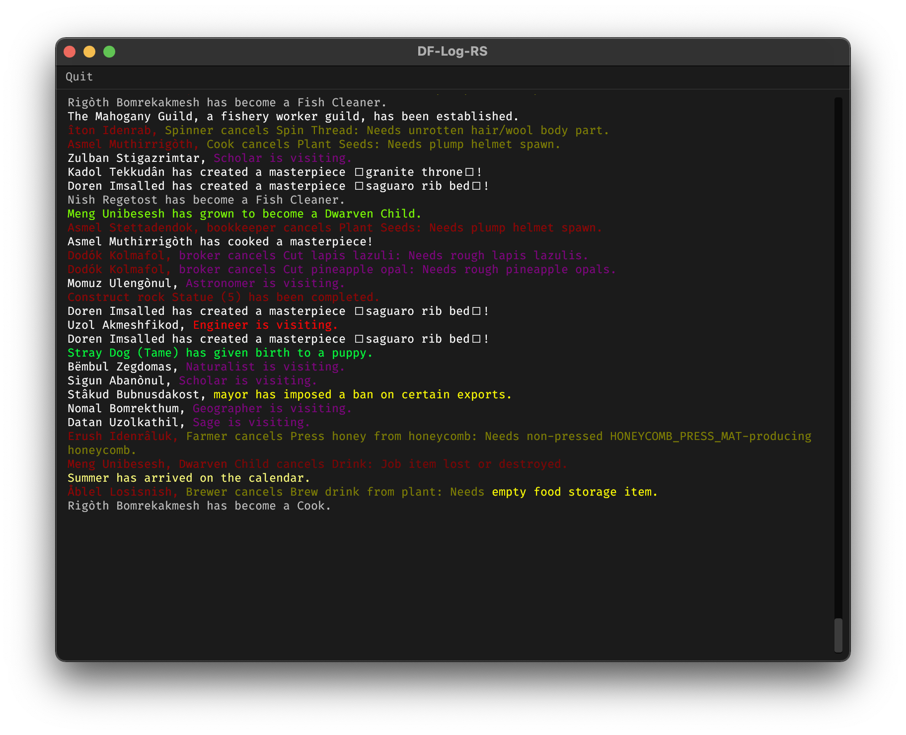

# DF-Log-RS

## What's it looking like?

## What's working so far?

- [x] Reading and parsing the DF `gamelog.txt`
- [x] Combined configuration
- [x] GUI proof of concept
- [] Further fleshed out GUI
